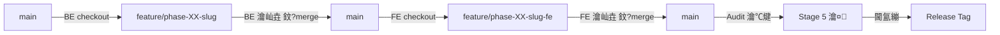

---
description: 澶?Agent 骞惰鍗忚 鈥?瑙掕壊鍖栦細璇濆叆鍙?+ 鏂囦欢椹卞姩鍗忚皟 + 鍒嗘敮闅旂
version: "2.0"
updated_at: "2026-03-01"
---

# 澶?Agent 骞惰鍗忚

鏈枃浠跺畾涔変簡 AI 澶у瀷绯荤粺寮€鍙戝伐浣滄祦鐨勫 Agent 骞惰妯″紡銆傚綋鐢ㄦ埛浠ヨ鑹插叧閿瘝鍚姩浼氳瘽鏃讹紝AI 鑷姩杩涘叆瀵瑰簲瑙掕壊鐨勬墽琛屾祦銆?

> **閫傜敤鏉′欢**锛氶」鐩寘鍚墠鍚庣鍒嗙鏋舵瀯锛坄backend/` + `frontend/` 鎴栫被浼肩粨鏋勶級銆?
> **鍚戝悗鍏煎**锛氭棤瑙掕壊鍏抽敭璇嶆椂锛岄€€鍥炲崟 Agent 涓茶妯″紡锛堢敱 `workflow-main.md` 椹卞姩锛夈€?

---

## 搂1 妯″紡閫夋嫨

| 妯″紡 | 瑙﹀彂鏉′欢 | 宸ヤ綔鏂瑰紡 |
|------|---------|---------|
| **鍗?Agent 涓茶** | 杈撳叆"缁х画" / Plan 鏂囦欢 / 鑷劧璇█闇€姹?| 鐢?`workflow-main.md` 椹卞姩锛屼竴涓細璇濆鐞嗘墍鏈変换鍔?|
| **澶?Agent 骞惰** | 杈撳叆鍖呭惈瑙掕壊鍏抽敭璇嶏紙瑙?搂2锛?| 姣忎釜瑙掕壊涓€涓嫭绔嬩細璇濓紝閫氳繃鏂囦欢椹卞姩鍗忚皟 |

---

## 搂2 瑙掕壊瀹氫箟

### Orchestrator锛堢紪鎺掕€咃級

| 椤圭洰 | 璇存槑 |
|------|------|
| **鍏抽敭璇?* | `缂栨帓` / `orchestrator` / `瑙勫垝` |
| **宸ュ叿** | 浠绘剰 AI锛圕odex / Antigravity / Claude锛?|
| **璐熻矗 Stage** | Stage 0 / 1 / 2 / 3 / Stage 5 楠屾敹鍐崇瓥 / Stage 6 |
| **鑱岃矗** | 闇€姹傚垎鏋愩€佹灦鏋勮璁°€侀樁娈佃鍒掋€佷换鍔″垎瑙ｃ€丄PI 鍚堢害鐢熸垚銆佸叏灞€杩涘害绠℃帶銆侀獙鏀跺喅绛?|
| **鍙搷浣滅洰褰?* | `docs/`銆乣phases/`銆乣database/`銆侀」鐩厤缃枃浠?|
| **涓嶅彲鎿嶄綔** | `backend/`銆乣frontend/`锛堢暀缁欐墽琛?Agent锛?|
| **杈撳嚭鐗?* | `todolist.csv`銆乣process.md`銆乣docs/api-contracts/*.yaml`銆乣SYNC.md` 鏇存柊 |

### Backend Engineer锛堝悗绔伐绋嬪笀锛?

| 椤圭洰 | 璇存槑 |
|------|------|
| **鍏抽敭璇?* | `鍚庣` / `鍚庣宸ョ▼甯坄 / `backend` / `backend engineer` |
| **宸ュ叿** | Codex / Antigravity |
| **璐熻矗 Stage** | Stage 4锛堜粎 `area=backend` 鎴?`role=backend` 鐨勪换鍔★級 |
| **鑱岃矗** | 鍚庣 API 寮€鍙戙€丼ervice 灞傘€丷epository 灞傘€佹暟鎹簱杩佺Щ鎵ц銆佸悗绔崟鍏冩祴璇曘€侀泦鎴愭祴璇?|
| **鍙搷浣滅洰褰?* | `backend/`銆乣database/`銆乣tests/backend/`銆乣docs/api-contracts/CHANGELOG.md` |
| **涓嶅彲鎿嶄綔** | `frontend/` |
| **Git 鍒嗘敮** | `feature/phase-XX-<slug>` |

### Frontend Engineer锛堝墠绔伐绋嬪笀锛?

| 椤圭洰 | 璇存槑 |
|------|------|
| **鍏抽敭璇?* | `鍓嶇` / `鍓嶇宸ョ▼甯坄 / `frontend` / `frontend engineer` |
| **宸ュ叿** | Gemini CLI / Antigravity |
| **璐熻矗 Stage** | Stage 4锛堜粎 `area=frontend` 鎴?`role=frontend` 鐨勪换鍔★級 |
| **鑱岃矗** | 椤甸潰缁勪欢寮€鍙戙€佽矾鐢变笌鐘舵€佺鐞嗐€丄PI 瀵规帴銆佸墠绔粍浠舵祴璇曘€佽瑙夊榻愩€佸鑸棴鐜?|
| **鍙搷浣滅洰褰?* | `frontend/`銆乣tests/frontend/`锛堟垨妗嗘灦鍐?`__tests__/`锛?|
| **涓嶅彲鎿嶄綔** | `backend/`銆乣database/` |
| **Git 鍒嗘敮** | `feature/phase-XX-<slug>-fe` |

### Audit Engineer锛堝璁″伐绋嬪笀锛?

| 椤圭洰 | 璇存槑 |
|------|------|
| **鍏抽敭璇?* | `瀹¤` / `瀹¤宸ョ▼甯坄 / `audit` / `review` / `瀹℃煡` |
| **宸ュ叿** | Claude Opus |
| **璐熻矗 Stage** | Stage 5锛堜唬鐮佸璁°€佹灦鏋勫悎瑙勩€佸畨鍏ㄦ壂鎻忥級 |
| **鑱岃矗** | 浠ｇ爜瀹夊叏瀹¤銆佹灦鏋勪竴鑷存€ф鏌ャ€佸洖褰掓祴璇曞鏌ャ€佷骇鍝佸榻愬害瀹℃煡銆佸鑸棴鐜鏌?|
| **鍙搷浣滅洰褰?* | 鍙鎵€鏈夌洰褰曪紝浠呭啓鍏?`phases/phase-XX/review/` |
| **Git 鍒嗘敮** | 鍦ㄥ悎骞跺悗鐨?`main` 鎴?feature 鍒嗘敮涓婂鏌?|

---

## 搂3 Boot Protocol锛堜細璇濆惎鍔ㄥ崗璁級

姣忎釜瑙掕壊鍦ㄤ細璇濆紑濮嬫椂**蹇呴』**鎵ц浠ヤ笅 Boot Protocol锛?

### Step 1锛氳鑹茬‘璁?

浠庣敤鎴疯緭鍏ヤ腑鎻愬彇瑙掕壊鍏抽敭璇嶏紝纭褰撳墠瑙掕壊韬唤銆傝緭鍑猴細

```
馃幆 瑙掕壊纭锛歔Backend Engineer / Frontend Engineer / Audit Engineer]
馃搵 宸ヤ綔妯″紡锛氬 Agent 骞惰
```

### Step 2锛氶」鐩姸鎬佹壂鎻?

1. 璇诲彇 `process.md`锛岃幏鍙栵細
   - `current_phase`锛氬綋鍓嶆椿璺?Phase
   - `phase_status`锛氬悇 Phase 瀹屾垚鐘舵€?
2. 璇诲彇 `SYNC.md`锛堣嫢瀛樺湪锛夛紝鑾峰彇鍏朵粬 Agent 鏈€鏂板姩鎬?
3. 璇诲彇 `todolist.csv`锛岃繃婊ゆ湰瑙掕壊浠诲姟锛堟寜 `area` 鎴?`role` 瀛楁锛?

### Step 3锛歅hase 鑷姩妫€娴?

褰撶敤鎴锋湭鏄惧紡鎸囧畾 Phase 鏃讹紝鎸変互涓嬭鍒欒嚜鍔ㄧ‘瀹氬伐浣?Phase锛?

| 瑙掕壊 | 妫€娴嬭鍒?|
|------|---------|
| Backend | 鎵惧埌绗竴涓惈鏈?`area=backend` 涓?`dev_state鈮犲凡瀹屾垚` 鐨?Phase |
| Frontend | 鎵惧埌绗竴涓惈鏈?`area=frontend` 涓?`dev_state鈮犲凡瀹屾垚` 鐨?Phase |
| Audit | 鎵惧埌绗竴涓墍鏈夋墽琛屼换鍔?`dev_state=宸插畬鎴恅 浣?`review_state鈮犲凡瀹屾垚` 鐨?Phase |

### Step 4锛欸it 鍒嗘敮鑷姩妫€娴嬩笌鍒囨崲

```bash
# 1. 鑾峰彇褰撳墠鍒嗘敮
current_branch=$(git branch --show-current)

# 2. 璁＄畻鏈熸湜鍒嗘敮
# Backend: feature/phase-XX-<slug>
# Frontend: feature/phase-XX-<slug>-fe
# Audit: main 鎴?feature 鍒嗘敮锛堝彧璇伙級

# 3. 鑻ヤ笉鍖归厤锛岃嚜鍔ㄥ垏鎹?
if [ "$current_branch" != "$expected_branch" ]; then
    # 妫€鏌ュ垎鏀槸鍚﹀瓨鍦?
    if git show-ref --verify --quiet "refs/heads/$expected_branch"; then
        git checkout "$expected_branch"
    else
        # 鍒涘缓鍒嗘敮
        # Backend: 浠?main 鍒囧嚭
        # Frontend: 浠?main (鍚庣宸插悎骞? 鎴栧悗绔垎鏀垏鍑?
        git checkout -b "$expected_branch" "$base_branch"
    fi
fi
```

杈撳嚭锛?
```
馃尶 Git 鍒嗘敮锛歠eature/phase-03-hr-attendance-fe锛堝凡鑷姩鍒囨崲锛?
```

### Step 5锛氫换鍔＄姸鎬佹憳瑕?

杈撳嚭褰撳墠瑙掕壊鐨勪换鍔℃憳瑕侊細

```
馃搳 浠诲姟鐘舵€佹憳瑕侊紙Phase 3 路 Frontend锛夛細
- 鎬讳换鍔★細12 鏉?
- 宸插畬鎴愶細4 鏉?
- 杩涜涓細1 鏉★紙PH03-FE-050锛氬憳宸ュ垪琛ㄩ〉闈級
- 鏈紑濮嬶細7 鏉?
- 闃诲锛? 鏉?

鈻讹笍 鍗冲皢鎵ц锛歅H03-FE-050锛堜粠鏂偣鎭㈠锛?
```

### Step 6锛氫緷璧栨鏌ヤ笌绛夊緟鍒ゆ柇

妫€鏌ュ綋鍓嶈鑹茬殑鏈紑濮嬩换鍔℃槸鍚︽湁鏈弧瓒崇殑渚濊禆锛堝 Frontend 浠诲姟渚濊禆 Backend API锛夛細

- **渚濊禆宸叉弧瓒?* 鈫?姝ｅ父杩涘叆 Stage 4 鎵ц娴?
- **渚濊禆鏈弧瓒?* 鈫?杩涘叆绛夊緟妯″紡锛堣 搂7锛?

---

## 搂4 Git 鍒嗘敮绛栫暐

### 鍒嗘敮鍛藉悕瑙勮寖

```
main                               鈫?绋冲畾涓诲共
鈹溾攢鈹€ feature/phase-XX-<slug>        鈫?Backend Engineer 鍒嗘敮
鈹溾攢鈹€ feature/phase-XX-<slug>-fe     鈫?Frontend Engineer 鍒嗘敮
鈹斺攢鈹€ ...
```

### 鍒嗘敮鐢熷懡鍛ㄦ湡



### 骞惰鍒嗘敮瑙勫垯

1. **鍚庣鍏堣**锛氬悗绔垎鏀粠 `main` 鍒囧嚭锛屽畬鎴愬悗鍚堝苟鍥?`main`
2. **鍓嶇璺熻繘**锛氬墠绔垎鏀粠鍚庣宸插悎骞剁殑 `main` 鍒囧嚭锛岀‘淇濇湁绋冲畾 API 鍙鎺?
3. **骞惰绐楀彛**锛氬悗绔彲浠ュ湪 Phase N+1 宸ヤ綔锛屽悓鏃跺墠绔湪 Phase N 宸ヤ綔
4. **鐩綍闅旂**锛氫袱涓?Agent **缁濅笉淇敼瀵规柟鐨勭洰褰?*
5. **鍏变韩杈圭晫**锛氫粎 `docs/api-contracts/` 涓嬬殑 API 鍚堢害鏂囦欢

### 鑷姩閫傞厤妫€娴?

褰撳伐浣滄祦鍦ㄤ换鎰忛」鐩腑鍚姩澶?Agent 妯″紡鏃讹細

1. 鎵弿椤圭洰鐩綍缁撴瀯锛屾娴嬪墠鍚庣鍒嗙鐗瑰緛锛?
   - `backend/` + `frontend/`
   - `server/` + `client/`
   - `backend/` + `frontend/`
   - 鐙珛 `package.json`锛堝墠绔級+ `pom.xml` / `go.mod` / `requirements.txt`锛堝悗绔級
2. 鑷姩鏄犲皠鍓嶅悗绔洰褰曞埌鍒嗘敮绛栫暐
3. 鑻ユ娴嬩笉鍒板垎绂荤粨鏋勶紝鎻愮ず鐢ㄦ埛纭鐩綍鏄犲皠

---

## 搂5 API 鍚堢害鍚屾鍗忚

### 鍚堢害鐢熸垚锛圤rchestrator 鑱岃矗锛?

Orchestrator 鍦?Stage 3 浠诲姟鍒嗚В鏃讹紝涓烘瘡涓?Phase 鐢熸垚 API 鍚堢害锛?

```
docs/api-contracts/
鈹溾攢鈹€ phase-03-attendance.yaml       鈫?OpenAPI 3.0 鏍煎紡
鈹溾攢鈹€ phase-04-settlement.yaml
鈹溾攢鈹€ CHANGELOG.md                   鈫?鍚堢害鍙樻洿鏃ュ織
鈹斺攢鈹€ ...
```

### 鍚堢害鐗堟湰杩借釜

CSV `todolist.csv` 鏂板鍙€夊瓧娈?`contract_version`锛?
- Orchestrator 鍦ㄧ敓鎴愬墠绔换鍔℃椂鍐欏叆褰撳墠鍚堢害鐗堟湰锛堝 `v1.0.0`锛?
- Frontend Agent 鎵ц浠诲姟鍓嶆鏌ヨ鐗堟湰鏄惁涓?CHANGELOG 鏈€鏂扮増鏈竴鑷?

### Breaking Change 澶勭悊娴佺▼

```
Backend Agent 瀹屾垚 API 鍙樻洿
    鈫?鏇存柊 CHANGELOG.md锛堟爣璁?breaking_change: true锛?
    鈫?鏇存柊 SYNC.md锛堥€氱煡 Frontend锛?
    鈫?鎻愪氦鍒板悗绔垎鏀?

Frontend Agent Boot Protocol 妫€娴嬪埌 breaking change
    鈫?鑷姩鍒涘缓 REWORK 浠诲姟鍒?CSV
    鈫?鍦?SYNC.md 璁板綍 rework 璁″垝
    鈫?鎸夋柊鍚堢害璋冩暣鍓嶇浠ｇ爜
```

### 鍓嶇 Mock 绛栫暐

Frontend Agent 鍙熀浜?API 鍚堢害 YAML 鎻愬墠寮€鍙戯細
1. 浠?YAML 鐢熸垚 Mock 鏁版嵁锛堜娇鐢?MSW / json-server / Axios interceptor锛?
2. 寮€鍙戞椂浣跨敤 Mock锛屽悗绔氨缁悗鍒囨崲 `baseURL`
3. 鍒囨崲鍚庤繍琛岄泦鎴愭祴璇曢獙璇?API 涓€鑷存€?

---

## 搂6 鏂囦欢椹卞姩鍗忚皟

### 閫氫俊鏂囦欢鐭╅樀

| 鏂囦欢 | 鐢ㄩ€?| 鍐欏叆鏂?| 璇诲彇鏂?| 鏇存柊棰戠巼 |
|------|------|--------|--------|---------|
| `process.md` | 鍏ㄥ眬杩涘害 + current_phase | Orchestrator | 鎵€鏈?Agent | 姣忎釜 Stage 缁撴潫 |
| `phases/phase-XX/todolist.csv` | 浠诲姟闃熷垪涓庣姸鎬?| Orchestrator 鍒涘缓 / 鎵ц Agent 鏇存柊鐘舵€?| 鎵ц Agent | 姣忔潯浠诲姟缁撶畻鍚?|
| `SYNC.md` | 璺?Agent 鍚屾鏃ュ織 | 鎵€鏈?Agent | 鎵€鏈?Agent | 姣忔壒浠诲姟鍚?|
| `docs/api-contracts/*.yaml` | API 鍚堢害 | Orchestrator | BE + FE Agent | Stage 3 鐢熸垚 |
| `docs/api-contracts/CHANGELOG.md` | 鍚堢害鍙樻洿鏃ュ織 | BE Agent | FE Agent | API 鍙樻洿鏃?|
| `phases/phase-XX/handoff.md` | 闃舵浜ゆ帴鏂囨。 | 鎵ц Agent | Audit Agent | Phase 鎵ц瀹屾垚鏃?|

### SYNC.md 鍐欏叆瑙勮寖

姣忎釜 Agent 鍦ㄥ畬鎴愪竴鎵逛换鍔″悗锛岃拷鍔犱竴鏉?SYNC 璁板綍锛?

```markdown
## <鏃ユ湡鏃堕棿> <瑙掕壊>
- 鉁?瀹屾垚 <浠诲姟 ID 鑼冨洿>锛?鎽樿>锛?
- 馃攧 <杩涜涓换鍔?
- 鈿狅笍 <鍙戠幇鐨勯棶棰樻垨鍙樻洿>
- 馃搶 <瀵瑰叾浠?Agent 鐨勯€氱煡>
```

---

## 搂7 绛夊緟鏈哄埗锛圕ooperative Scheduling锛?

褰撹鑹叉棤鍙墽琛屼换鍔℃椂锛?*涓嶅仛绌鸿浆鎬濊€?*锛屾墽琛屼互涓嬪崗璁細

### 绛夊緟瑙﹀彂鏉′欢

1. 鎵€鏈夋湰瑙掕壊浠诲姟宸插畬鎴?
2. 鎵€鏈夋湭寮€濮嬩换鍔＄殑鍓嶇疆渚濊禆鏈弧瓒筹紙绛夊緟鍏朵粬 Agent锛?
3. Orchestrator 灏氭湭涓哄綋鍓?Phase 鐢熸垚 `todolist.csv`
4. API 鍚堢害灏氭湭鐢熸垚锛團rontend 绛夊緟 Orchestrator锛?

### 绛夊緟杈撳嚭鏍煎紡

```
鈴?褰撳墠瑙掕壊鏃犲彲鎵ц浠诲姟

馃搵 绛夊緟鍘熷洜锛?
- PH03-FE-070锛堟墦鍗￠〉闈級渚濊禆 PH03-BE-070锛堟墦鍗?API锛夛紝Backend 灏氭湭瀹屾垚
- PH03-FE-080锛堣€冨嫟鎶ヨ〃锛変緷璧?PH03-BE-080锛堟姤琛?API锛夛紝Backend 灏氭湭寮€濮?

馃挕 寤鸿鎿嶄綔锛?
1. 璇峰湪 Backend Engineer 浼氳瘽涓户缁悗绔紑鍙?
2. 鍚庣瀹屾垚鍚庯紝鍥炲埌鏈細璇濊緭鍏ャ€屽墠绔伐绋嬪笀缁х画宸ヤ綔銆嶅嵆鍙仮澶?

馃搳 鍏朵粬瑙掕壊鐘舵€侊細
- Backend: Phase 3 杩涜涓紙6/12 宸插畬鎴愶級
- Audit: 绛夊緟 Phase 3 鍏ㄩ儴瀹屾垚
```

### 琛屼负绾︽潫

- **绂佹鐚滄祴**锛氫笉浼氱寽娴嬩緷璧栦綍鏃跺畬鎴愭垨灏濊瘯璺宠繃渚濊禆鎵ц
- **绂佹绌鸿浆**锛氫笉浼氶噸澶嶈鍙栨枃浠舵垨寰幆绛夊緟
- **鐩存帴缁撴潫**锛氳緭鍑虹瓑寰呬俊鎭悗绔嬪嵆缁撴潫鏈浜や簰

---

## 搂8 Cross-Role Status Check锛堣法瑙掕壊鐘舵€佹鏌ワ級

### 瑙﹀彂鏃舵満

姣忎釜瑙掕壊鍦ㄤ互涓嬫椂鏈烘墽琛岃法瑙掕壊妫€鏌ワ細
1. 瀹屾垚涓€鎵逛换鍔″悗锛堣繛缁畬鎴?3 鏉′互涓婏級
2. 杩涘叆绛夊緟妯″紡鍓?
3. 褰撳墠 Phase 鎵€鏈夋湰瑙掕壊浠诲姟瀹屾垚鏃?

### 妫€鏌ラ€昏緫

```
1. 鎵弿 todolist.csv 涓墍鏈変换鍔★紝鎸?role/area 鍒嗙粍
2. 缁熻鍚勮鑹茬殑 宸插畬鎴?杩涜涓?鏈紑濮?闃诲 鏁伴噺
3. 璇嗗埆灏氭湭寮€濮嬪伐浣滅殑瑙掕壊
4. 杈撳嚭鎻愮ず
```

### 杈撳嚭鏍煎紡

```
馃搵 璺ㄨ鑹茬姸鎬佹鏌ワ細
鈹屸攢鈹€鈹€鈹€鈹€鈹€鈹€鈹€鈹€鈹€鈹€鈹€鈹€鈹攢鈹€鈹€鈹€鈹€鈹€鈹€鈹€鈹€鈹€鈹€鈹攢鈹€鈹€鈹€鈹€鈹€鈹€鈹€鈹€鈹€鈹攢鈹€鈹€鈹€鈹€鈹€鈹€鈹€鈹€鈹€鈹?
鈹?瑙掕壊        鈹?宸插畬鎴?   鈹?杩涜涓?  鈹?鏈紑濮?  鈹?
鈹溾攢鈹€鈹€鈹€鈹€鈹€鈹€鈹€鈹€鈹€鈹€鈹€鈹€鈹尖攢鈹€鈹€鈹€鈹€鈹€鈹€鈹€鈹€鈹€鈹€鈹尖攢鈹€鈹€鈹€鈹€鈹€鈹€鈹€鈹€鈹€鈹尖攢鈹€鈹€鈹€鈹€鈹€鈹€鈹€鈹€鈹€鈹?
鈹?Backend     鈹?12/12 鉁? 鈹?0        鈹?0        鈹?
鈹?Frontend    鈹?0/12  鉂? 鈹?0        鈹?12       鈹?
鈹?Audit       鈹?0/1   鈴? 鈹?0        鈹?1        鈹?
鈹斺攢鈹€鈹€鈹€鈹€鈹€鈹€鈹€鈹€鈹€鈹€鈹€鈹€鈹粹攢鈹€鈹€鈹€鈹€鈹€鈹€鈹€鈹€鈹€鈹€鈹粹攢鈹€鈹€鈹€鈹€鈹€鈹€鈹€鈹€鈹€鈹粹攢鈹€鈹€鈹€鈹€鈹€鈹€鈹€鈹€鈹€鈹?

鈿狅笍 Frontend 瑙掕壊鐨勪换鍔″叏閮ㄦ湭寮€濮嬶紒
馃挕 璇峰惎鍔?Frontend Engineer 浼氳瘽锛氳緭鍏ャ€屼綘鏄墠绔伐绋嬪笀璇风户缁伐浣溿€?
```

---

## 搂9 骞惰绐楀彛绛栫暐

### 鍚庣棰嗗厛鍓嶇 1 涓?Phase

```mermaid
gantt
    title 澶?Agent 骞惰鏃堕棿绾?
    dateFormat  X
    axisFormat %s

    section Backend
    Phase N BE    :be1, 0, 2
    Phase N+1 BE  :be2, 2, 4

    section Frontend
    Phase N-1 FE  :fe0, 0, 1
    Phase N FE    :fe1, 1, 3
    Phase N+1 FE  :fe2, 3, 5

    section Audit
    Phase N-1 瀹¤ :au0, 1, 2
    Phase N 瀹¤   :au1, 3, 4
```



### 绐楀彛瑙勫垯

1. Backend Agent 瀹屾垚 Phase N 鍚庯紝绔嬪嵆閫氱煡 Orchestrator 鍚姩 Phase N+1 鐨?Stage 3
2. Frontend Agent 鍦?Backend Phase N 瀹屾垚鍚庡紑濮?Phase N 鐨勫墠绔紑鍙?
3. Audit Agent 鍦?Phase N 鍓嶅悗绔兘瀹屾垚鍚庡惎鍔ㄥ璁?
4. 鍓嶇鍙熀浜?API 鍚堢害 Mock 鎻愬墠寮€鍙戯紝瀹炵幇閮ㄥ垎骞惰

