# 多 Agent 并行协议

本文件定义了 AI 大型系统开发工作流的多 Agent 并行模式。当用户以角色关键词启动会话时，AI 自动进入对应角色的执行流。

> **设计哲学**：各本地 CLI 工具本质上是可组合的 Unix 微工具——每个模型做一个极度尖锐的「函数」，通过本地文件系统作为唯一消息总线（File-System-as-Message-Bus）实现松耦合异步协同，无需复杂的网络编排引擎。

> **适用条件**：项目包含前后端分离架构（`src/backend/` + `src/frontend/` 或类似结构）。
> **向后兼容**：无角色关键词时，退回单 Agent 串行模式（由 `workflow-main.md` 驱动）。

---

## §1 模式选择

| 模式 | 触发条件 | 工作方式 |
|------|---------|---------|
| **单 Agent 串行** | 输入"继续" / Plan 文件 / 自然语言需求 | 由 `workflow-main.md` 驱动，一个会话处理所有任务 |
| **多 Agent 并行** | 输入包含角色关键词（见 §2） | 每个角色一个独立会话，通过文件驱动协调 |

---

## §2 角色定义

### Orchestrator（编排者）

| 项目 | 说明 |
|------|------|
| **关键词** | `编排` / `orchestrator` / `规划` |
| **工具** | 任意 AI（Codex / Antigravity / Claude） |
| **负责 Stage** | Stage 0 / 1 / 2 / 3 / Stage 5 验收决策 / Stage 6 |
| **职责** | 需求分析、架构设计、阶段规划、任务分解、API 合约生成、全局进度管控、验收决策 |
| **可操作目录** | `docs/`、`phases/`、`database/`、项目配置文件 |
| **不可操作** | `src/backend/`、`src/frontend/`（留给执行 Agent） |
| **输出物** | `todolist.csv`、`process.md`、`docs/api-contracts/*.yaml`、`SYNC.md` 更新 |

### Backend Engineer（后端工程师）

| 项目 | 说明 |
|------|------|
| **关键词** | `后端` / `后端工程师` / `backend` / `backend engineer` |
| **工具** | Codex / Antigravity |
| **负责 Stage** | Stage 4（仅 `area=backend` 或 `role=backend` 的任务） |
| **职责** | 后端 API 开发、Service 层、Repository 层、数据库迁移执行、后端单元测试、集成测试 |
| **可操作目录** | `src/backend/`、`database/`、`tests/backend/`、`docs/api-contracts/CHANGELOG.md` |
| **不可操作** | `src/frontend/` |
| **Git 分支** | `feature/phase-XX-<slug>`（从 `dev` 切出） |

### Frontend Engineer（前端工程师）

| 项目 | 说明 |
|------|------|
| **关键词** | `前端` / `前端工程师` / `frontend` / `frontend engineer` |
| **工具** | Gemini CLI / Antigravity |
| **负责 Stage** | Stage 4（仅 `area=frontend` 或 `role=frontend` 的任务） |
| **职责** | 页面组件开发、路由与状态管理、API 对接、前端组件测试、视觉对齐、导航闭环 |
| **可操作目录** | `src/frontend/`、`tests/frontend/`（或框架内 `__tests__/`） |
| **不可操作** | `src/backend/`、`database/` |
| **Git 分支** | `feature/phase-XX-<slug>-fe`（从 `dev` 切出） |

### Audit Engineer（审计工程师）

| 项目 | 说明 |
|------|------|
| **关键词** | `审计` / `审计工程师` / `audit` / `review` / `审查` |
| **工具** | Claude Opus |
| **负责 Stage** | Stage 5（代码审计、架构合规、安全扫描） |
| **职责** | 代码安全审计、架构一致性检查、回归测试审查、产品对齐度审查、导航闭环审查 |
| **可操作目录** | 只读所有目录，仅写入 `phases/phase-XX/review/` |
| **Git 分支** | 在合并后的 `dev` 或 feature 分支上审查 |

---

## §3 Boot Protocol（会话启动协议）

每个角色在会话开始时**必须**执行以下 Boot Protocol：

### Step 1：角色确认

从用户输入中提取角色关键词，确认当前角色身份。输出：

```
🎯 角色确认：[Backend Engineer / Frontend Engineer / Audit Engineer]
📋 工作模式：多 Agent 并行
```

### Step 2：项目状态扫描

1. 读取 `process.md`，获取：
   - `current_phase`：当前活跃 Phase
   - `phase_status`：各 Phase 完成状态
2. 读取 `SYNC.md`（若存在），获取其他 Agent 最新动态
3. 读取 `todolist.csv`，过滤本角色任务（按 `area` 或 `role` 字段）

### Step 3：Phase 自动检测

当用户未显式指定 Phase 时，按以下规则自动确定工作 Phase：

| 角色 | 检测规则 |
|------|---------|
| Backend | 找到第一个含有 `area=backend` 且 `dev_state≠已完成` 的 Phase |
| Frontend | 找到第一个含有 `area=frontend` 且 `dev_state≠已完成` 的 Phase |
| Audit | 找到第一个所有执行任务 `dev_state=已完成` 但 `review_state≠已完成` 的 Phase |

### Step 4：Git 分支自动检测与切换

```bash
# 1. 获取当前分支
current_branch=$(git branch --show-current)

# 2. 计算期望分支
# Backend: feature/phase-XX-<slug>
# Frontend: feature/phase-XX-<slug>-fe
# Audit: dev 或 feature 分支（只读）

# 3. 若不匹配，自动切换
if [ "$current_branch" != "$expected_branch" ]; then
    # 检查分支是否存在
    if git show-ref --verify --quiet "refs/heads/$expected_branch"; then
        git checkout "$expected_branch"
    else
        # 创建分支
        # Backend: 从 dev 切出
        # Frontend: 从 dev (后端已合并) 切出
        git checkout -b "$expected_branch" dev
    fi
fi
```

输出：
```
🌿 Git 分支：feature/phase-03-hr-attendance-fe（已自动切换）
```

### Step 5：任务状态摘要

输出当前角色的任务摘要：

```
📊 任务状态摘要（Phase 3 · Frontend）：
- 总任务：12 条
- 已完成：4 条
- 进行中：1 条（PH03-FE-050：员工列表页面）
- 未开始：7 条
- 阻塞：0 条

▶️ 即将执行：PH03-FE-050（从断点恢复）
```

### Step 6：依赖检查与等待判断

检查当前角色的未开始任务是否有未满足的依赖（如 Frontend 任务依赖 Backend API）：

- **依赖已满足** → 正常进入 Stage 4 执行流
- **依赖未满足** → 进入等待模式（见 §7）

---

## §4 Git 分支策略

### 分支命名规范

```
prod                               ← 生产主干（仅 Stage 6 发布时 merge）
└── dev                            ← 开发主干（Stage 5 通过后 merge）
    ├── feature/phase-XX-<slug>    ← Backend Engineer 分支
    ├── feature/phase-XX-<slug>-fe ← Frontend Engineer 分支
    └── ...
```

### 分支生命周期

```mermaid
graph LR
    D[dev] -->|BE checkout| BE[feature/phase-XX-slug]
    BE -->|BE 完成 → merge| D2[dev]
    D2 -->|FE checkout| FE[feature/phase-XX-slug-fe]
    FE -->|FE 完成 → merge| D3[dev]
    D3 -->|Audit 审查| AUDIT[Stage 5 审计]
    AUDIT -->|"所有 Phase 通过"| S6[Stage 6]
    S6 -->|"merge dev → prod"| P[prod]
    P -->|"打 Tag"| TAG[Release Tag]
```



### Branch Auto-Adapt Protocol（自动分支适配协议）

Stage 0 项目初始化时自动检测并调整分支结构：

| 现有分支结构 | 操作 | 说明 |
|-----------------|------|------|
| 仅有 `main` | `git branch -m main dev && git branch prod dev` | 重命名 main→dev，从 dev 创建 prod |
| `main` + `develop` | `git branch -m develop dev && git branch -m main prod` | 映射 develop→dev，main→prod |
| 已有 `dev` + `prod` | 无操作 | 直接使用 |
| 其他结构 | 提示用户确认分支映射 | 等待用户输入 |

> ⚠️ **远程仓库注意**：本地分支重命名后，需要用户手动在远程仓库（GitHub/GitLab）更新默认分支设置。

### 并行分支规则

1. **后端先行**：后端分支从 `dev` 切出，完成后合并回 `dev`
2. **前端跟进**：前端分支从后端已合并的 `dev` 切出，确保有稳定 API 可对接
3. **并行窗口**：后端可以在 Phase N+1 工作，同时前端在 Phase N 工作
4. **目录隔离**：两个 Agent **绝不修改对方的目录**
5. **共享边界**：仅 `docs/api-contracts/` 下的 API 合约文件
6. **生产发布**：所有 Phase 完成后，Stage 6 将 `dev` merge 到 `prod` 并打 Release Tag

### 自动适配检测

当工作流在任意项目中启动多 Agent 模式时：

1. 扫描项目目录结构，检测前后端分离特征：
   - `src/backend/` + `src/frontend/`
   - `server/` + `client/`
   - `backend/` + `frontend/`
   - 独立 `package.json`（前端）+ `pom.xml` / `go.mod` / `requirements.txt`（后端）
2. 自动映射前后端目录到分支策略
3. 若检测不到分离结构，提示用户确认目录映射

---

## §5 API 合约同步协议

### 合约生成（Orchestrator 职责）

Orchestrator 在 Stage 3 任务分解时，为每个 Phase 生成 API 合约：

```
docs/api-contracts/
├── phase-03-attendance.yaml       ← OpenAPI 3.0 格式
├── phase-04-settlement.yaml
├── CHANGELOG.md                   ← 合约变更日志
└── ...
```

### 合约版本追踪

CSV `todolist.csv` 新增可选字段 `contract_version`：
- Orchestrator 在生成前端任务时写入当前合约版本（如 `v1.0.0`）
- Frontend Agent 执行任务前检查该版本是否与 CHANGELOG 最新版本一致

### Breaking Change 处理流程

```
Backend Agent 完成 API 变更
    → 更新 CHANGELOG.md（标记 breaking_change: true）
    → 更新 SYNC.md（通知 Frontend）
    → 提交到后端分支

Frontend Agent Boot Protocol 检测到 breaking change
    → 自动创建 REWORK 任务到 CSV
    → 在 SYNC.md 记录 rework 计划
    → 按新合约调整前端代码
```

### 前端 Mock 策略

Frontend Agent 可基于 API 合约 YAML 提前开发：
1. 从 YAML 生成 Mock 数据（使用 MSW / json-server / Axios interceptor）
2. 开发时使用 Mock，后端就绪后切换 `baseURL`
3. 切换后运行集成测试验证 API 一致性

---

## §6 文件驱动协调

### 通信文件矩阵

| 文件 | 用途 | 写入方 | 读取方 | 更新频率 |
|------|------|--------|--------|---------|
| `process.md` | 全局进度 + current_phase | Orchestrator | 所有 Agent | 每个 Stage 结束 |
| `phases/phase-XX/todolist.csv` | 任务队列与状态 | Orchestrator 创建 / 执行 Agent 更新状态 | 执行 Agent | 每条任务结算后 |
| `SYNC.md` | 跨 Agent 同步日志 | 所有 Agent | 所有 Agent | 每批任务后 |
| `docs/api-contracts/*.yaml` | API 合约 | Orchestrator | BE + FE Agent | Stage 3 生成 |
| `docs/api-contracts/CHANGELOG.md` | 合约变更日志 | BE Agent | FE Agent | API 变更时 |
| `phases/phase-XX/handoff.md` | 阶段交接文档 | 执行 Agent | Audit Agent | Phase 执行完成时 |

### SYNC.md 写入规范

每个 Agent 在完成一批任务后，追加一条 SYNC 记录：

```markdown
## <日期时间> <角色>
- ✅ 完成 <任务 ID 范围>（<摘要>）
- 🔄 <进行中任务>
- ⚠️ <发现的问题或变更>
- 📌 <对其他 Agent 的通知>
```

---

## §7 等待机制（Cooperative Scheduling）

当角色无可执行任务时，**不做空转思考**，执行以下协议：

### 等待触发条件

1. 所有本角色任务已完成
2. 所有未开始任务的前置依赖未满足（等待其他 Agent）
3. Orchestrator 尚未为当前 Phase 生成 `todolist.csv`
4. API 合约尚未生成（Frontend 等待 Orchestrator）

### 等待输出格式

```
⏳ 当前角色无可执行任务

📋 等待原因：
- PH03-FE-070（打卡页面）依赖 PH03-BE-070（打卡 API），Backend 尚未完成
- PH03-FE-080（考勤报表）依赖 PH03-BE-080（报表 API），Backend 尚未开始

💡 建议操作：
1. 请在 Backend Engineer 会话中继续后端开发
2. 后端完成后，回到本会话输入「前端工程师继续工作」即可恢复

📊 其他角色状态：
- Backend: Phase 3 进行中（6/12 已完成）
- Audit: 等待 Phase 3 全部完成
```

### 行为约束

- **禁止猜测**：不会猜测依赖何时完成或尝试跳过依赖执行
- **禁止空转**：不会重复读取文件或循环等待
- **直接结束**：输出等待信息后立即结束本次交互

---

## §8 Cross-Role Status Check（跨角色状态检查）

### 触发时机

每个角色在以下时机执行跨角色检查：
1. 完成一批任务后（连续完成 3 条以上）
2. 进入等待模式前
3. 当前 Phase 所有本角色任务完成时

### 检查逻辑

```
1. 扫描 todolist.csv 中所有任务，按 role/area 分组
2. 统计各角色的 已完成/进行中/未开始/阻塞 数量
3. 识别尚未开始工作的角色
4. 输出提示
```

### 输出格式

```
📋 跨角色状态检查：
┌─────────────┬───────────┬──────────┬──────────┐
│ 角色        │ 已完成    │ 进行中   │ 未开始   │
├─────────────┼───────────┼──────────┼──────────┤
│ Backend     │ 12/12 ✅  │ 0        │ 0        │
│ Frontend    │ 0/12  ❌  │ 0        │ 12       │
│ Audit       │ 0/1   ⏳  │ 0        │ 1        │
└─────────────┴───────────┴──────────┴──────────┘

⚠️ Frontend 角色的任务全部未开始！
💡 请启动 Frontend Engineer 会话：输入「你是前端工程师请继续工作」
```

---

## §9 并行窗口策略

### 后端领先前端 1 个 Phase

```mermaid
gantt
    title 多 Agent 并行时间线
    dateFormat  X
    axisFormat %s

    section Backend
    Phase N BE    :be1, 0, 2
    Phase N+1 BE  :be2, 2, 4

    section Frontend
    Phase N-1 FE  :fe0, 0, 1
    Phase N FE    :fe1, 1, 3
    Phase N+1 FE  :fe2, 3, 5

    section Audit
    Phase N-1 审计 :au0, 1, 2
    Phase N 审计   :au1, 3, 4
```



### 窗口规则

1. Backend Agent 完成 Phase N 后，立即通知 Orchestrator 启动 Phase N+1 的 Stage 3
2. Frontend Agent 在 Backend Phase N 完成后开始 Phase N 的前端开发
3. Audit Agent 在 Phase N 前后端都完成后启动审计
4. 前端可基于 API 合约 Mock 提前开发，实现部分并行
